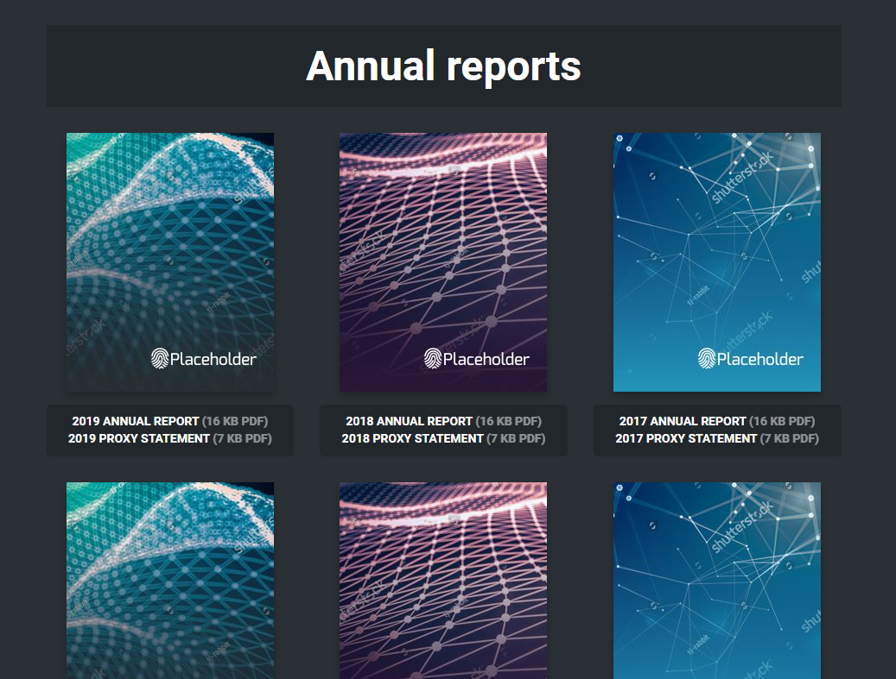
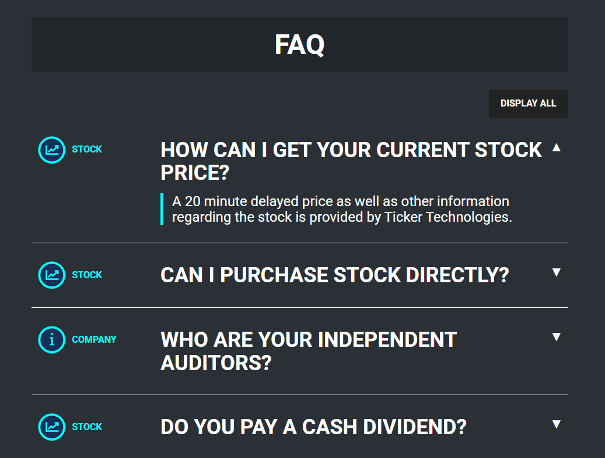
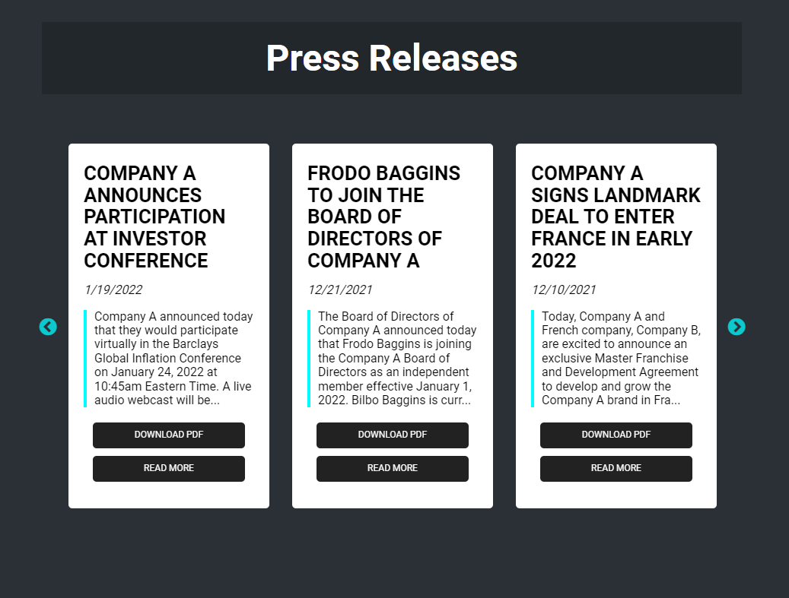

# [Q4 Inc.](https://q4inc.com/)

## Front-end Developer Assessment

Welcome to the front-end developer assessment package.
This assessment consists of 3 sections that you will need to complete as per instructions below and will ultimately demonstrate your development skill level in:

- Basic HTML5, CSS3, JavaScript/jQuery
- Understanding of templating engines (specifically Mustache.js)
- Ability to troubleshoot common syntax issues within a front-end environment and resolve bugs
- Ability to implement third party libraries and plugins
- Accuracy of design and content with attention to browser compatibility (Chrome, Firefox, Safari, Edge, and IE 11)


## Getting Started & Submitting

Please `clone` this repository to your own github account and then immediately make an `initial commit`. Then create a branch called `"fed-test-v2--submission"` to work off of. Upon completion, commit your changes to this branch and leave unmerged from the master branch.

There are 2 ways that you can view this project once you've cloned: 
- If you have Node.js installed on your machine, you can run the project through the Node package `http-server` by opening up the project in a CLI and running the following commands:

```
$ npm install
$ npm start
```

- Alternatively, simply open the `index.html` file located within the `src` folder
in your favourite web browser.


----

## 1. Annual Reports


### Complete the build of this template-powered reports page by fixing all errors and styling in a way that is responsive and widely browser-compatible, accurately matching the design, layout, and content of the image above.

### CSS
- *normalize.css* - Ensures consistent rendering of elements across browsers
- *main.css* - A simple CSS starting point used to achieve the final expected outcome of the assessment

### JS
- *libraries.js* - jQuery, Mustache.js
- *dataset-ar.js* - Sample data set of reports for section
- *main.js* - Functionality for section

### Instructions
- Fix any bugs or typos
- Make all items `30px` apart and flow within a `3 column` grid that switches to a `2 column` grid when at a viewport width of `768px`, and then a `1 column` grid at a viewport width of `480px` and below. Consider how the page will scale as more reports are added over time.

----

## 2. FAQ

 ### Complete the build of this template-powered FAQ page by appropriately modifying the FAQ data before it is rendered, updating the template, and then finishing the implementation of the accordion/toggle functionality. 

### CSS
- *normalize.css* - Ensures consistent rendering of elements across browsers
- *main.css* - A simple CSS starting point used to achieve the final expected outcome of the assessment

### JS
- *libraries.js* - jQuery, Mustache.js
- *dataset-faq.js* - Sample data set of FAQ content for section
- *q4.app.js* - Reusable functions for website
- *main.js* - Functionality for section

### Instructions
- Fix any bugs or typos
- Manipulate the FAQ data so that each item includes the appropriate `icon filpath` and renders it beside each respective item
- Update the template to include the FAQ item `category` under each icon
- Fix the implementation of the `accordion/toggle functionality`
- Modify the accordion/toggle to turn on the `'Show all / Hide all' button`

---

## 3. Press Releases

 ### Complete the build of this template-powered Press Release page by appropriately modifying the Press Release data before it is rendered, and then properly implementing the third party jQuery plugin, Slick Slider, as per the instructions below.

### CSS
- *normalize.css* - Ensures consistent rendering of elements across browsers
- *main.css* - A simple CSS starting point used to achieve the final expected outcome of the assessment
- *slick.min.css* (externally linked CDN)
- *slick-theme.min.css* (externally linked CDN) 

### JS
- *libraries.js* - jQuery, Mustache.js
- *dataset-pr.js* - Sample data set of Press Release content for section
- *q4.app.js* - Reusable functions for website
- *slick.min.js* (externally linked CDN)
- *main.js* - Functionality for section

### Instructions
- Fix any bugs or typos
- Manipulate the Press Release data so that the items rendered to the template `exclude any of the Press Releases with 'earnings' in its tag list`. There are a total of 2 items that should not be rendered. 
- Implement `Slick Slider` for the Press Release items in the following manner:
    - Screen sizes > 1024px
        - slides shown: 3
        - slides scrolled: 3
        - dots: no
        - arrows: yes
    - Screen sizes 1024px - 768px
        - slides shown: 2
        - slides scrolled: 2
        - dots: yes
        - arrows: yes
    - Screen sizes < 768px
        - slides shown: 1
        - slides scrolled: 1
        - dots: yes
        - arrows: yes
